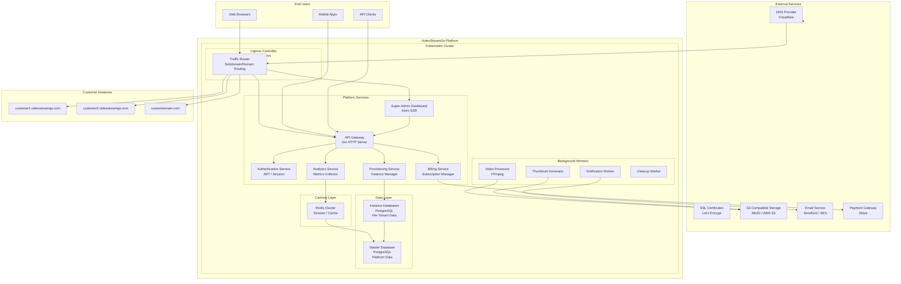
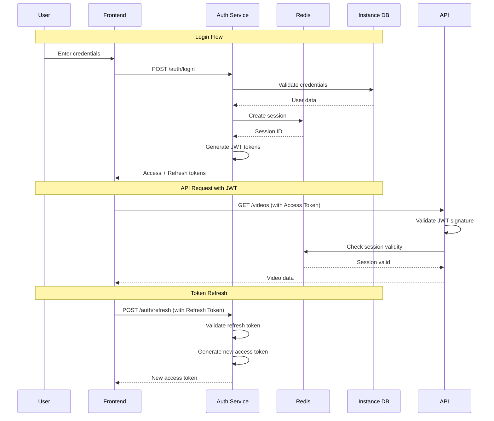
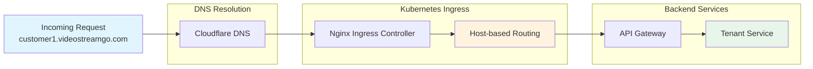
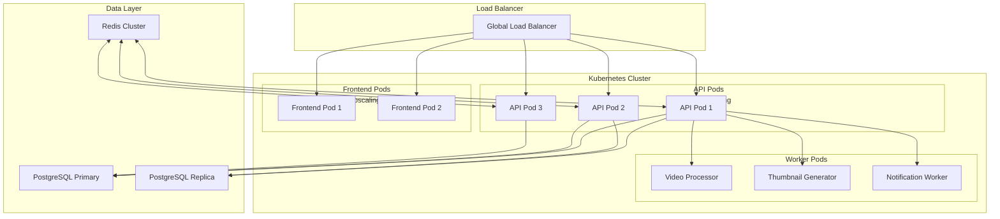

# VideoStreamGo Architecture Design Document

**Version:** 1.0  
**Date:** January 2025  
**Status:** Phase 2 - Architecture Design Complete

---

## Table of Contents

1. [Executive Summary](#1-executive-summary)
2. [System Architecture](#2-system-architecture)
   - [High-Level Architecture Diagram](#21-high-level-architecture-diagram)
   - [Component Overview](#22-component-overview)
3. [API Architecture](#3-api-architecture)
   - [Platform API](#31-platform-api)
   - [Instance API](#32-instance-api)
   - [Authentication Flow](#33-authentication-flow)
   - [Multi-Tenant Middleware](#34-multi-tenant-middleware)
4. [Database Schema Design](#4-database-schema-design)
   - [Master Database Schema](#41-master-database-schema)
   - [Per-Instance Database Schema](#42-per-instance-database-schema)
   - [Indexing Strategy](#43-indexing-strategy)
5. [Multi-Tenancy Implementation](#5-multi-tenancy-implementation)
   - [Subdomain-Based Routing](#51-subdomain-based-routing)
   - [Custom Domain Support](#52-custom-domain-support)
   - [Database Connection Management](#53-database-connection-management)
   - [Tenant Context Management](#54-tenant-context-management)
6. [Infrastructure Design](#6-infrastructure-design)
   - [Docker Container Structure](#61-docker-container-structure)
   - [Kubernetes Deployment](#62-kubernetes-deployment)
   - [Ingress Controller Configuration](#63-ingress-controller-configuration)
   - [Provisioning Automation](#64-provisioning-automation)
7. [Tech Stack Finalization](#7-tech-stack-finalization)
   - [Backend Libraries](#71-backend-libraries)
   - [Frontend Libraries](#72-frontend-libraries)
   - [Testing Frameworks](#73-testing-frameworks)
   - [CI/CD Pipeline](#74-cicd-pipeline)
8. [Security Considerations](#8-security-considerations)
9. [Performance Optimization](#9-performance-optimization)
10. [Scalability Strategy](#10-scalability-strategy)

---

## 1. Executive Summary

VideoStreamGo is a white-label multi-tenant video tube SaaS platform that enables customers to deploy their own branded video sharing websites. The platform follows a **subdomain-per-tenant** model where each customer receives an isolated instance with customizable branding, categories, and content management capabilities.

### Key Architectural Decisions

| Decision | Rationale |
|----------|-----------|
| Hybrid Multi-Tenancy | Master database for platform management + per-instance databases for customer data isolation |
| Subdomain-Based Routing | Native DNS support, easy SSL provisioning, clear tenant identification |
| Go/Gin Backend | High performance, excellent concurrency support, mature ecosystem |
| Astro SSR Frontend | SEO-friendly, fast initial loads, component-based architecture |
| PostgreSQL | Robust relational database with strong data integrity guarantees |
| S3-Compatible Storage | Scalable object storage with cost-effective video hosting |

---

## 2. System Architecture

### 2.1 High-Level Architecture Diagram



### 2.2 Component Overview

#### 2.2.1 Platform Services

| Service | Purpose | Technology |
|---------|---------|------------|
| **API Gateway** | Central entry point for all API requests, rate limiting, request routing | Gin + Custom Middleware |
| **Authentication Service** | User registration, login, JWT token management, session handling | Go + Redis |
| **Provisioning Service** | Customer instance creation, database provisioning, domain setup | Go + PostgreSQL |
| **Billing Service** | Subscription management, payment processing, invoice generation | Go + Stripe SDK |
| **Analytics Service** | Usage metrics collection, reporting, dashboard data | Go + TimescaleDB |
| **Super Admin Dashboard** | Platform management UI for administrators | Astro SSR |

#### 2.2.2 Background Workers

| Worker | Purpose | Trigger |
|--------|---------|---------|
| **Video Processor** | Video transcoding, format conversion, quality optimization | Queue-based |
| **Thumbnail Generator** | Generate video thumbnails at multiple resolutions | Event-based |
| **Notification Worker** | Send email notifications, push notifications | Queue-based |
| **Cleanup Worker** | Remove orphaned files, archive old data, clean temp files | Scheduled |

---

## 3. API Architecture

### 3.1 Platform API

The Platform API manages customer accounts, billing, and platform-wide operations.

```
Base URL: https://api.videostreamgo.com/v1

├── /customers
│   ├── GET    /customers                    # List all customers
│   ├── POST   /customers                    # Create new customer
│   ├── GET    /customers/{id}               # Get customer details
│   ├── PUT    /customers/{id}               # Update customer
│   ├── DELETE /customers/{id}               # Delete customer
│   ├── POST   /customers/{id}/suspend       # Suspend customer
│   └── POST   /customers/{id}/activate      # Activate customer
│
├── /instances
│   ├── GET    /instances                    # List all instances
│   ├── POST   /instances                    # Create new instance
│   ├── GET    /instances/{id}               # Get instance details
│   ├── PUT    /instances/{id}               # Update instance
│   ├── DELETE /instances/{id}               # Delete instance
│   ├── POST   /instances/{id}/provision     # Provision instance
│   └── POST   /instances/{id}/deprovision   # Deprovision instance
│
├── /billing
│   ├── GET    /subscriptions                # List all subscriptions
│   ├── GET    /subscriptions/{id}           # Get subscription details
│   ├── POST   /subscriptions                # Create subscription
│   ├── PUT    /subscriptions/{id}           # Update subscription
│   ├── DELETE /subscriptions/{id}           # Cancel subscription
│   ├── GET    /invoices                     # List invoices
│   └── GET    /invoices/{id}                # Get invoice details
│
├── /analytics
│   ├── GET    /analytics/platform           # Platform-wide analytics
│   ├── GET    /analytics/customers          # Customer analytics
│   └── GET    /analytics/usage              # Resource usage metrics
│
└── /admin
    ├── GET    /admin/users                  # List platform users
    ├── POST   /admin/users                  # Create admin user
    └── GET    /admin/settings               # Platform settings
```

### 3.2 Instance API

The Instance API handles customer-specific operations within their isolated environment.

```
Base URL: https://{subdomain}.videostreamgo.com/v1
       or https://{custom-domain}/v1

Instance API follows the same structure for each tenant:

├── /videos
│   ├── GET    /videos                       # List videos (with filters)
│   ├── POST   /videos                       # Upload new video
│   ├── GET    /videos/{id}                  # Get video details
│   ├── PUT    /videos/{id}                  # Update video
│   ├── DELETE /videos/{id}                  # Delete video
│   ├── POST   /videos/{id}/view             # Record view
│   ├── POST   /videos/{id}/rate             # Rate video
│   └── GET    /videos/{id}/comments         # Get comments
│
├── /users
│   ├── GET    /users                        # List users (admin only)
│   ├── GET    /users/{id}                   # Get user profile
│   ├── PUT    /users/{id}                   # Update user
│   ├── POST   /users/{id}/ban               # Ban user (admin)
│   └── POST   /users/{id}/unban             # Unban user (admin)
│
├── /categories
│   ├── GET    /categories                   # List categories
│   ├── POST   /categories                   # Create category
│   ├── PUT    /categories/{id}              # Update category
│   └── DELETE /categories/{id}              # Delete category
│
├── /tags
│   ├── GET    /tags                         # List tags
│   ├── POST   /tags                         # Create tag
│   └── DELETE /tags/{id}                    # Delete tag
│
├── /comments
│   ├── GET    /comments                     # List comments
│   ├── POST   /comments                     # Create comment
│   ├── PUT    /comments/{id}                # Update comment
│   └── DELETE /comments/{id}                # Delete comment
│
├── /favorites
│   ├── GET    /favorites                    # Get user's favorites
│   ├── POST   /favorites                    # Add to favorites
│   └── DELETE /favorites/{id}               # Remove from favorites
│
└── /branding
    ├── GET    /branding                     # Get instance branding
    └── PUT    /branding                     # Update branding (admin)
```

### 3.3 Authentication Flow



### 3.4 Multi-Tenant Middleware

```go
package middleware

import (
    "net/http"
    "strings"
    
    "github.com/gin-gonic/gin"
    "videostreamgo/internal/tenant"
)

// TenantMiddleware extracts tenant context from subdomain
func TenantMiddleware() gin.HandlerFunc {
    return func(c *gin.Context) {
        host := c.Request.Host
        subdomain := extractSubdomain(host)
        
        // Check if custom domain
        if isCustomDomain(host) {
            tenantID, err := resolveTenantByDomain(host)
            if err != nil {
                c.JSON(http.StatusNotFound, gin.H{
                    "error": "Instance not found",
                })
                c.Abort()
                return
            }
            c.Set("tenant_id", tenantID)
        } else {
            // Subdomain-based tenant
            if subdomain == "www" || subdomain == "api" || subdomain == "admin" {
                // Platform-level routes
                c.Set("tenant_id", "platform")
            } else {
                c.Set("tenant_id", subdomain)
            }
        }
        
        c.Next()
    }
}

// extractSubdomain extracts subdomain from host
func extractSubdomain(host string) string {
    parts := strings.Split(host, ".")
    if len(parts) >= 3 {
        return parts[0]
    }
    return ""
}

// TenantContext holds the current tenant information
type TenantContext struct {
    ID           string
    Name         string
    DatabaseURL  string
    StorageBucket string
    Branding     map[string]string
}

// GetTenantContext retrieves tenant context from Gin context
func GetTenantContext(c *gin.Context) *tenant.TenantContext {
    tenantID, exists := c.Get("tenant_id")
    if !exists {
        return nil
    }
    
    // Fetch from cache or database
    return tenant.GetTenant(tenantID.(string))
}
```

---

## 4. Database Schema Design

### 4.1 Master Database Schema

The master database stores platform-level data including customers, subscriptions, and instance configurations.

```sql
-- Master Database Schema

-- Customers table: Main customer accounts
CREATE TABLE customers (
    id UUID PRIMARY KEY DEFAULT gen_random_uuid(),
    email VARCHAR(255) UNIQUE NOT NULL,
    password_hash VARCHAR(255) NOT NULL,
    company_name VARCHAR(255) NOT NULL,
    contact_name VARCHAR(255),
    phone VARCHAR(50),
    status VARCHAR(50) DEFAULT 'active' CHECK (status IN ('active', 'suspended', 'cancelled')),
    created_at TIMESTAMP WITH TIME ZONE DEFAULT NOW(),
    updated_at TIMESTAMP WITH TIME ZONE DEFAULT NOW(),
    metadata JSONB DEFAULT '{}'
);

-- Instances table: Customer video tube instances
CREATE TABLE instances (
    id UUID PRIMARY KEY DEFAULT gen_random_uuid(),
    customer_id UUID NOT NULL REFERENCES customers(id) ON DELETE CASCADE,
    name VARCHAR(255) NOT NULL,
    subdomain VARCHAR(63) UNIQUE NOT NULL,
    custom_domains TEXT[] DEFAULT '{}',
    status VARCHAR(50) DEFAULT 'pending' CHECK (status IN ('pending', 'provisioning', 'active', 'suspended', 'terminated')),
    plan_id UUID REFERENCES subscription_plans(id),
    database_name VARCHAR(63) NOT NULL,
    storage_bucket VARCHAR(63) NOT NULL,
    created_at TIMESTAMP WITH TIME ZONE DEFAULT NOW(),
    updated_at TIMESTAMP WITH TIME ZONE DEFAULT NOW(),
    activated_at TIMESTAMP WITH TIME ZONE,
    metadata JSONB DEFAULT '{}'
);

-- Subscription plans table
CREATE TABLE subscription_plans (
    id UUID PRIMARY KEY DEFAULT gen_random_uuid(),
    name VARCHAR(100) NOT NULL,
    description TEXT,
    monthly_price DECIMAL(10, 2) NOT NULL,
    yearly_price DECIMAL(10, 2) NOT NULL,
    max_storage_gb INTEGER NOT NULL DEFAULT 100,
    max_bandwidth_gb INTEGER NOT NULL DEFAULT 1000,
    max_videos INTEGER NOT NULL DEFAULT 10000,
    max_users INTEGER NOT NULL DEFAULT 10000,
    features JSONB DEFAULT '[]',
    is_active BOOLEAN DEFAULT true,
    created_at TIMESTAMP WITH TIME ZONE DEFAULT NOW()
);

-- Subscriptions table
CREATE TABLE subscriptions (
    id UUID PRIMARY KEY DEFAULT gen_random_uuid(),
    customer_id UUID NOT NULL REFERENCES customers(id),
    plan_id UUID NOT NULL REFERENCES subscription_plans(id),
    status VARCHAR(50) DEFAULT 'active' CHECK (status IN ('active', 'cancelled', 'past_due', 'paused')),
    billing_cycle VARCHAR(20) DEFAULT 'monthly' CHECK (billing_cycle IN ('monthly', 'yearly')),
    stripe_subscription_id VARCHAR(255),
    stripe_customer_id VARCHAR(255),
    current_period_start TIMESTAMP WITH TIME ZONE,
    current_period_end TIMESTAMP WITH TIME ZONE,
    cancel_at_period_end BOOLEAN DEFAULT false,
    created_at TIMESTAMP WITH TIME ZONE DEFAULT NOW(),
    updated_at TIMESTAMP WITH TIME ZONE DEFAULT NOW()
);

-- Usage metrics table
CREATE TABLE usage_metrics (
    id UUID PRIMARY KEY DEFAULT gen_random_uuid(),
    instance_id UUID NOT NULL REFERENCES instances(id),
    metric_type VARCHAR(50) NOT NULL CHECK (metric_type IN ('storage', 'bandwidth', 'videos', 'users', 'views')),
    period_start TIMESTAMP WITH TIME ZONE NOT NULL,
    period_end TIMESTAMP WITH TIME ZONE NOT NULL,
    value BIGINT NOT NULL,
    created_at TIMESTAMP WITH TIME ZONE DEFAULT NOW(),
    UNIQUE(instance_id, metric_type, period_start)
);

-- Instance configurations table
CREATE TABLE instance_config (
    id UUID PRIMARY KEY DEFAULT gen_random_uuid(),
    instance_id UUID NOT NULL REFERENCES instances(id) ON DELETE CASCADE,
    config_key VARCHAR(100) NOT NULL,
    config_value TEXT NOT NULL,
    created_at TIMESTAMP WITH TIME ZONE DEFAULT NOW(),
    updated_at TIMESTAMP WITH TIME ZONE DEFAULT NOW(),
    UNIQUE(instance_id, config_key)
);

-- Billing records table
CREATE TABLE billing_records (
    id UUID PRIMARY KEY DEFAULT gen_random_uuid(),
    customer_id UUID NOT NULL REFERENCES customers(id),
    subscription_id UUID REFERENCES subscriptions(id),
    amount DECIMAL(10, 2) NOT NULL,
    currency VARCHAR(3) DEFAULT 'USD',
    status VARCHAR(50) DEFAULT 'pending' CHECK (status IN ('pending', 'paid', 'failed', 'refunded')),
    invoice_id VARCHAR(255),
    stripe_payment_intent_id VARCHAR(255),
    period_start TIMESTAMP WITH TIME ZONE,
    period_end TIMESTAMP WITH TIME ZONE,
    created_at TIMESTAMP WITH TIME ZONE DEFAULT NOW()
);

-- Platform settings table
CREATE TABLE platform_settings (
    id UUID PRIMARY KEY DEFAULT 1,
    key VARCHAR(100) UNIQUE NOT NULL,
    value TEXT NOT NULL,
    description TEXT,
    updated_at TIMESTAMP WITH TIME ZONE DEFAULT NOW()
);

-- Indexes for master database
CREATE INDEX idx_instances_customer ON instances(customer_id);
CREATE INDEX idx_instances_subdomain ON instances(subdomain);
CREATE INDEX idx_instances_status ON instances(status);
CREATE INDEX idx_subscriptions_customer ON subscriptions(customer_id);
CREATE INDEX idx_subscriptions_status ON subscriptions(status);
CREATE INDEX idx_usage_metrics_instance ON usage_metrics(instance_id, metric_type);
CREATE INDEX idx_usage_metrics_period ON usage_metrics(period_start, period_end);
CREATE INDEX idx_billing_records_customer ON billing_records(customer_id);
CREATE INDEX idx_billing_records_status ON billing_records(status);
CREATE INDEX idx_billing_records_created ON billing_records(created_at);
```

### 4.2 Per-Instance Database Schema

Each customer instance has its own database with the following schema:

```sql
-- Instance Database Schema (per tenant)

-- Users table
CREATE TABLE users (
    id UUID PRIMARY KEY DEFAULT gen_random_uuid(),
    username VARCHAR(50) UNIQUE NOT NULL,
    email VARCHAR(255) UNIQUE NOT NULL,
    password_hash VARCHAR(255) NOT NULL,
    display_name VARCHAR(100),
    avatar_url VARCHAR(500),
    bio TEXT,
    role VARCHAR(50) DEFAULT 'user' CHECK (role IN ('user', 'moderator', 'admin')),
    status VARCHAR(50) DEFAULT 'active' CHECK (status IN ('active', 'banned', 'suspended')),
    email_verified BOOLEAN DEFAULT false,
    last_login_at TIMESTAMP WITH TIME ZONE,
    created_at TIMESTAMP WITH TIME ZONE DEFAULT NOW(),
    updated_at TIMESTAMP WITH TIME ZONE DEFAULT NOW(),
    metadata JSONB DEFAULT '{}'
);

-- Videos table
CREATE TABLE videos (
    id UUID PRIMARY KEY DEFAULT gen_random_uuid(),
    title VARCHAR(255) NOT NULL,
    slug VARCHAR(255) UNIQUE NOT NULL,
    description TEXT,
    user_id UUID NOT NULL REFERENCES users(id),
    category_id UUID REFERENCES categories(id),
    status VARCHAR(50) DEFAULT 'processing' CHECK (status IN ('processing', 'active', 'hidden', 'deleted')),
    video_url VARCHAR(500) NOT NULL,
    thumbnail_url VARCHAR(500),
    duration INTEGER, -- in seconds
    file_size BIGINT, -- in bytes
    resolution VARCHAR(20), -- e.g., '1080p', '720p'
    view_count BIGINT DEFAULT 0,
    like_count INTEGER DEFAULT 0,
    dislike_count INTEGER DEFAULT 0,
    comment_count INTEGER DEFAULT 0,
    is_featured BOOLEAN DEFAULT false,
    is_public BOOLEAN DEFAULT true,
    published_at TIMESTAMP WITH TIME ZONE,
    created_at TIMESTAMP WITH TIME ZONE DEFAULT NOW(),
    updated_at TIMESTAMP WITH TIME ZONE DEFAULT NOW(),
    metadata JSONB DEFAULT '{}'
);

-- Categories table
CREATE TABLE categories (
    id UUID PRIMARY KEY DEFAULT gen_random_uuid(),
    name VARCHAR(100) NOT NULL,
    slug VARCHAR(100) UNIQUE NOT NULL,
    description TEXT,
    parent_id UUID REFERENCES categories(id),
    icon_url VARCHAR(500),
    color VARCHAR(7), -- Hex color code
    sort_order INTEGER DEFAULT 0,
    is_active BOOLEAN DEFAULT true,
    created_at TIMESTAMP WITH TIME ZONE DEFAULT NOW(),
    updated_at TIMESTAMP WITH TIME ZONE DEFAULT NOW()
);

-- Tags table
CREATE TABLE tags (
    id UUID PRIMARY KEY DEFAULT gen_random_uuid(),
    name VARCHAR(100) NOT NULL,
    slug VARCHAR(100) UNIQUE NOT NULL,
    usage_count INTEGER DEFAULT 0,
    created_at TIMESTAMP WITH TIME ZONE DEFAULT NOW()
);

-- Video tags junction table
CREATE TABLE video_tags (
    video_id UUID NOT NULL REFERENCES videos(id) ON DELETE CASCADE,
    tag_id UUID NOT NULL REFERENCES tags(id) ON DELETE CASCADE,
    created_at TIMESTAMP WITH TIME ZONE DEFAULT NOW(),
    PRIMARY KEY (video_id, tag_id)
);

-- Comments table
CREATE TABLE comments (
    id UUID PRIMARY KEY DEFAULT gen_random_uuid(),
    video_id UUID NOT NULL REFERENCES videos(id) ON DELETE CASCADE,
    user_id UUID NOT NULL REFERENCES users(id),
    parent_id UUID REFERENCES comments(id),
    content TEXT NOT NULL,
    is_edited BOOLEAN DEFAULT false,
    is_deleted BOOLEAN DEFAULT false,
    like_count INTEGER DEFAULT 0,
    created_at TIMESTAMP WITH TIME ZONE DEFAULT NOW(),
    updated_at TIMESTAMP WITH TIME ZONE DEFAULT NOW()
);

-- Ratings table
CREATE TABLE ratings (
    id UUID PRIMARY KEY DEFAULT gen_random_uuid(),
    video_id UUID NOT NULL REFERENCES videos(id) ON DELETE CASCADE,
    user_id UUID NOT NULL REFERENCES users(id),
    rating SMALLINT NOT NULL CHECK (rating IN (-1, 1)),
    created_at TIMESTAMP WITH TIME ZONE DEFAULT NOW(),
    UNIQUE(video_id, user_id)
);

-- Favorites table
CREATE TABLE favorites (
    id UUID PRIMARY KEY DEFAULT gen_random_uuid(),
    user_id UUID NOT NULL REFERENCES users(id) ON DELETE CASCADE,
    video_id UUID NOT NULL REFERENCES videos(id) ON DELETE CASCADE,
    created_at TIMESTAMP WITH TIME ZONE DEFAULT NOW(),
    UNIQUE(user_id, video_id)
);

-- Playlists table
CREATE TABLE playlists (
    id UUID PRIMARY KEY DEFAULT gen_random_uuid(),
    user_id UUID NOT NULL REFERENCES users(id) ON DELETE CASCADE,
    name VARCHAR(255) NOT NULL,
    description TEXT,
    is_public BOOLEAN DEFAULT true,
    view_count BIGINT DEFAULT 0,
    created_at TIMESTAMP WITH TIME ZONE DEFAULT NOW(),
    updated_at TIMESTAMP WITH TIME ZONE DEFAULT NOW()
);

-- Playlist videos junction table
CREATE TABLE playlist_videos (
    playlist_id UUID NOT NULL REFERENCES playlists(id) ON DELETE CASCADE,
    video_id UUID NOT NULL REFERENCES videos(id) ON DELETE CASCADE,
    position INTEGER NOT NULL,
    added_at TIMESTAMP WITH TIME ZONE DEFAULT NOW(),
    PRIMARY KEY (playlist_id, video_id)
);

-- Video views table (for analytics)
CREATE TABLE video_views (
    id UUID PRIMARY KEY DEFAULT gen_random_uuid(),
    video_id UUID NOT NULL REFERENCES videos(id) ON DELETE CASCADE,
    user_id UUID REFERENCES users(id),
    ip_address INET,
    user_agent TEXT,
    referrer TEXT,
    country_code CHAR(2),
    watch_duration INTEGER, -- in seconds
    created_at TIMESTAMP WITH TIME ZONE DEFAULT NOW()
);

-- User sessions table
CREATE TABLE user_sessions (
    id UUID PRIMARY KEY DEFAULT gen_random_uuid(),
    user_id UUID NOT NULL REFERENCES users(id) ON DELETE CASCADE,
    token_hash VARCHAR(255) NOT NULL,
    ip_address INET,
    user_agent TEXT,
    expires_at TIMESTAMP WITH TIME ZONE NOT NULL,
    created_at TIMESTAMP WITH TIME ZONE DEFAULT NOW()
);

-- Instance branding configuration table
CREATE TABLE branding_config (
    id UUID PRIMARY KEY DEFAULT gen_random_uuid(),
    instance_id UUID NOT NULL, -- References master instances table
    site_name VARCHAR(255) DEFAULT 'VideoTube',
    logo_url VARCHAR(500),
    favicon_url VARCHAR(500),
    primary_color VARCHAR(7) DEFAULT '#2563eb',
    secondary_color VARCHAR(7) DEFAULT '#64748b',
    accent_color VARCHAR(7) DEFAULT '#f59e0b',
    background_color VARCHAR(7) DEFAULT '#ffffff',
    text_color VARCHAR(7) DEFAULT '#1e293b',
    header_html TEXT,
    footer_html TEXT,
    custom_css TEXT,
    social_links JSONB DEFAULT '{}',
    footer_links JSONB DEFAULT '[]',
    created_at TIMESTAMP WITH TIME ZONE DEFAULT NOW(),
    updated_at TIMESTAMP WITH TIME ZONE DEFAULT NOW()
);

-- Indexes for instance database
CREATE INDEX idx_videos_user ON videos(user_id);
CREATE INDEX idx_videos_category ON videos(category_id);
CREATE INDEX idx_videos_status ON videos(status);
CREATE INDEX idx_videos_created ON videos(created_at DESC);
CREATE INDEX idx_videos_view_count ON videos(view_count DESC);
CREATE INDEX idx_videos_slug ON videos(slug);
CREATE INDEX idx_comments_video ON comments(video_id, created_at DESC);
CREATE INDEX idx_comments_user ON comments(user_id);
CREATE INDEX idx_ratings_video ON ratings(video_id);
CREATE INDEX idx_favorites_user ON favorites(user_id);
CREATE INDEX idx_video_views_video ON video_views(video_id, created_at DESC);
CREATE INDEX idx_video_views_created ON video_views(created_at);
CREATE INDEX idx_user_sessions_user ON user_sessions(user_id);
CREATE INDEX idx_user_sessions_token ON user_sessions(token_hash);
CREATE INDEX idx_playlist_videos_playlist ON playlist_videos(playlist_id, position);
CREATE INDEX idx_tags_slug ON tags(slug);
CREATE INDEX idx_video_tags_tag ON video_tags(tag_id);
```

### 4.3 Indexing Strategy

| Table | Index Type | Columns | Purpose |
|-------|------------|---------|---------|
| videos | B-tree | (status, created_at DESC) | List active videos sorted by date |
| videos | B-tree | (user_id, created_at DESC) | User's video gallery |
| videos | B-tree | (category_id, created_at DESC) | Category video listings |
| videos | GIN | (to_tsvector('english', title)) | Full-text search |
| videos | B-tree | (view_count DESC) | Trending videos |
| comments | B-tree | (video_id, created_at DESC) | Video comment threads |
| ratings | B-tree | (video_id, rating) | Video rating calculations |
| users | B-tree | (username) | Username lookups |
| users | B-tree | (email) | Email lookups |
| video_views | BRIN | (created_at) | Time-series analytics |
| tags | B-tree | (usage_count DESC) | Popular tags |

---

## 5. Multi-Tenancy Implementation

### 5.1 Subdomain-Based Routing

The platform uses subdomain-based routing to identify and route requests to the appropriate tenant instance.



#### DNS Configuration

```yaml
# DNS Records Configuration
# Primary domain: videostreamgo.com

# A Records for bare domain
videostreamgo.com        A     203.0.113.1
www.videostreamgo.com    A     203.0.113.1
api.videostreamgo.com    A     203.0.113.1
admin.videostreamgo.com  A     203.0.113.1

# CNAME Records for wildcard subdomains
*.videostreamgo.com      CNAME videostreamgo.com

# A Records for custom domains (customer-specific)
customer1.com            A     203.0.113.1
www.customer1.com        A     203.0.113.1
```

### 5.2 Custom Domain Support

Custom domain support is implemented through SNI-based routing and automated SSL certificate provisioning.

```go
package domain

import (
    "context"
    "fmt"
    
    "videostreamgo/internal/models"
    "videostreamgo/internal/repository"
    "videostreamgo/pkg/certmanager"
)

// CustomDomainService manages custom domain provisioning
type CustomDomainService struct {
    domainRepo   repository.DomainRepository
    certManager  *certmanager.CertManager
    dnsProvider  DNSProvider
}

// ProvisionCustomDomain provisions a custom domain for a tenant
func (s *CustomDomainService) ProvisionCustomDomain(
    ctx context.Context,
    instanceID string,
    domain string,
) error {
    // Verify domain ownership via DNS challenge
    challenge, err := s.certManager.CreateChallenge(domain)
    if err != nil {
        return fmt.Errorf("failed to create DNS challenge: %w", err)
    }
    
    // Store DNS verification record
    verificationRecord := fmt.Sprintf(
        "_acme-challenge.%s IN TXT %s",
        domain,
        challenge.DNSChallenge,
    )
    
    // Configure DNS for domain verification
    err = s.dnsProvider.CreateTXTRecord(
        domain,
        "_acme-challenge",
        challenge.DNSChallenge,
        challenge.TTL,
    )
    if err != nil {
        return fmt.Errorf("failed to configure DNS: %w", err)
    }
    
    // Wait for DNS propagation
    err = s.certManager.WaitForPropagation(domain)
    if err != nil {
        return fmt.Errorf("DNS propagation failed: %w", err)
    }
    
    // Request SSL certificate
    cert, err := s.certManager.RequestCertificate(domain)
    if err != nil {
        return fmt.Errorf("failed to request certificate: %w", err)
    }
    
    // Store certificate in secret manager
    err = s.certManager.StoreCertificate(instanceID, domain, cert)
    if err != nil {
        return fmt.Errorf("failed to store certificate: %w", err)
    }
    
    // Update instance with custom domain
    instance, err := s.domainRepo.GetInstanceByID(instanceID)
    if err != nil {
        return err
    }
    
    instance.CustomDomains = append(instance.CustomDomains, domain)
    return s.domainRepo.UpdateInstance(instance)
}
```

### 5.3 Database Connection Management

Connection pooling is managed per-tenant with separate connection pools for each instance database.

```go
package db

import (
    "fmt"
    "sync"
    
    "github.com/jmoiron/sqlx"
    _ "github.com/lib/pq"
    "videostreamgo/internal/config"
)

// TenantDBManager manages database connections per tenant
type TenantDBManager struct {
    masterDB     *sqlx.DB
    pools        map[string]*sqlx.DB
    poolsMutex   sync.RWMutex
    config       *config.Config
}

// GetTenantDB returns a database connection for the specified tenant
func (m *TenantDBManager) GetTenantDB(tenantID string) (*sqlx.DB, error) {
    // Check if pool already exists
    m.poolsMutex.RLock()
    if pool, exists := m.pools[tenantID]; exists {
        m.poolsMutex.RUnlock()
        return pool, nil
    }
    m.poolsMutex.RUnlock()
    
    // Create new pool for tenant
    m.poolsMutex.Lock()
    defer m.poolsMutex.Unlock()
    
    // Double-check after acquiring write lock
    if pool, exists := m.pools[tenantID]; exists {
        return pool, nil
    }
    
    // Get tenant database configuration
    tenantConfig, err := m.getTenantDBConfig(tenantID)
    if err != nil {
        return nil, err
    }
    
    // Create new connection pool
    pool, err := sqlx.Connect(
        "postgres",
        fmt.Sprintf(
            "host=%s port=%d user=%s password=%s dbname=%s sslmode=require max_open_conns=%d max_idle_conns=%d conn_max_lifetime=%s",
            tenantConfig.Host,
            tenantConfig.Port,
            tenantConfig.Username,
            tenantConfig.Password,
            tenantConfig.Database,
            tenantConfig.MaxOpenConns,
            tenantConfig.MaxIdleConns,
            tenantConfig.ConnMaxLifetime,
        ),
    )
    if err != nil {
        return nil, fmt.Errorf("failed to connect to tenant database: %w", err)
    }
    
    m.pools[tenantID] = pool
    return pool, nil
}

// CloseTenantDB closes and removes a tenant's database connection pool
func (m *TenantDBManager) CloseTenantDB(tenantID string) error {
    m.poolsMutex.Lock()
    defer m.poolsMutex.Unlock()
    
    if pool, exists := m.pools[tenantID]; exists {
        pool.Close()
        delete(m.pools, tenantID)
    }
    
    return nil
}

// GetMasterDB returns the master database connection
func (m *TenantDBManager) GetMasterDB() *sqlx.DB {
    return m.masterDB
}
```

### 5.4 Tenant Context Management

Tenant context is managed through Go contexts with request-scoped storage.

```go
package tenant

import (
    "context"
    "sync"
)

type contextKey string

const (
    tenantContextKey contextKey = "tenant"
)

// TenantInfo holds all tenant-related information
type TenantInfo struct {
    ID            string
    Name          string
    DatabaseURL   string
    StorageBucket string
    Plan          *PlanInfo
    Branding      *BrandingInfo
    Features      map[string]bool
}

// PlanInfo holds subscription plan details
type PlanInfo struct {
    ID              string
    Name            string
    MaxStorageGB    int
    MaxBandwidthGB  int
    MaxVideos       int
    MaxUsers        int
}

// BrandingInfo holds tenant branding configuration
type BrandingInfo struct {
    SiteName       string
    LogoURL        string
    PrimaryColor   string
    SecondaryColor string
    CustomCSS      string
}

// WithTenant adds tenant information to context
func WithTenant(ctx context.Context, tenant *TenantInfo) context.Context {
    return context.WithValue(ctx, tenantContextKey, tenant)
}

// FromContext retrieves tenant information from context
func FromContext(ctx context.Context) *TenantInfo {
    if tenant, ok := ctx.Value(tenantContextKey).(*TenantInfo); ok {
        return tenant
    }
    return nil
}

// TenantManager manages tenant data and caching
type TenantManager struct {
    cache   map[string]*TenantInfo
    cacheMu sync.RWMutex
    repo    TenantRepository
}

// GetTenant retrieves tenant information (with caching)
func (m *TenantManager) GetTenant(tenantID string) (*TenantInfo, error) {
    // Check cache first
    m.cacheMu.RLock()
    if cached, exists := m.cache[tenantID]; exists {
        m.cacheMu.RUnlock()
        return cached, nil
    }
    m.cacheMu.RUnlock()
    
    // Fetch from database
    tenant, err := m.repo.GetTenantByID(tenantID)
    if err != nil {
        return nil, err
    }
    
    // Update cache
    m.cacheMu.Lock()
    m.cache[tenantID] = tenant
    m.cacheMu.Unlock()
    
    return tenant, nil
}

// InvalidateCache removes tenant from cache
func (m *TenantManager) InvalidateCache(tenantID string) {
    m.cacheMu.Lock()
    delete(m.cache, tenantID)
    m.cacheMu.Unlock()
}
```

---

## 6. Infrastructure Design

### 6.1 Docker Container Structure

```dockerfile
# Dockerfile.backend - Go API Service
FROM golang:1.21-alpine AS builder

WORKDIR /app

# Copy go.mod and go.sum
COPY go.mod go.sum ./
RUN go mod download

# Copy source code
COPY . .

# Build binary
RUN CGO_ENABLED=0 GOOS=linux go build -a -installsuffix cgo -o api-server ./cmd/api

# Production image
FROM alpine:3.19

# Install ca-certificates for HTTPS
RUN apk --no-cache add ca-certificates

WORKDIR /app

# Copy binary from builder
COPY --from=builder /app/api-server .
COPY --from=builder /app/config ./config

EXPOSE 8080

# Run as non-root user
RUN addgroup -g 1000 app && adduser -u 1000 -G app -s /bin/sh -D app
USER app

CMD ["./api-server"]
```

```dockerfile
# Dockerfile.frontend - Astro SSR Frontend
FROM node:20-alpine AS builder

WORKDIR /app

# Copy package files
COPY package*.json ./
RUN npm ci

# Copy source code
COPY . .

# Build for production
RUN npm run build

# Production image
FROM node:20-alpine

WORKDIR /app

# Copy built assets
COPY --from=builder /app/dist ./dist
COPY --from=builder /app/package*.json ./
COPY --from=builder /app/node_modules ./node_modules

EXPOSE 3000

CMD ["node", "dist/server/entry.mjs"]
```

```yaml
# docker-compose.yml
version: '3.8'

services:
  # Master database
  postgres-master:
    image: postgres:15-alpine
    environment:
      POSTGRES_USER: ${POSTGRES_USER:-videostreamgo}
      POSTGRES_PASSWORD: ${POSTGRES_PASSWORD:-securepassword}
      POSTGRES_DB: ${MASTER_DB_NAME:-videostreamgo_master}
    volumes:
      - postgres_master_data:/var/lib/postgresql/data
      - ./sql/master_schema.sql:/docker-entrypoint-initdb.d/01-schema.sql
    ports:
      - "5432:5432"
    networks:
      - videostreamgo_network
    healthcheck:
      test: ["CMD-SHELL", "pg_isready -U ${POSTGRES_USER:-videostreamgo}"]
      interval: 10s
      timeout: 5s
      retries: 5

  # Redis for caching and sessions
  redis:
    image: redis:7-alpine
    command: redis-server --appendonly yes
    volumes:
      - redis_data:/data
    ports:
      - "6379:6379"
    networks:
      - videostreamgo_network
    healthcheck:
      test: ["CMD", "redis-cli", "ping"]
      interval: 10s
      timeout: 5s
      retries: 5

  # MinIO for S3-compatible storage
  minio:
    image: minio/minio:latest
    command: server /data --console-address ":9001"
    environment:
      MINIO_ROOT_USER: ${MINIO_ROOT_USER:-minioadmin}
      MINIO_ROOT_PASSWORD: ${MINIO_ROOT_PASSWORD:-minioadmin}
    volumes:
      - minio_data:/data
    ports:
      - "9000:9000"
      - "9001:9001"
    networks:
      - videostreamgo_network
    healthcheck:
      test: ["CMD", "curl", "-f", "http://localhost:9000/minio/health/live"]
      interval: 30s
      timeout: 20s
      retries: 3

  # API Gateway
  api:
    build:
      context: ./backend
      dockerfile: Dockerfile.backend
    environment:
      - DB_HOST=postgres-master
      - DB_PORT=5432
      - DB_USER=${POSTGRES_USER:-videostreamgo}
      - DB_PASSWORD=${POSTGRES_PASSWORD:-securepassword}
      - DB_NAME=${MASTER_DB_NAME:-videostreamgo_master}
      - REDIS_HOST=redis
      - REDIS_PORT=6379
      - S3_ENDPOINT=minio:9000
      - S3_ACCESS_KEY=${MINIO_ROOT_USER:-minioadmin}
      - S3_SECRET_KEY=${MINIO_ROOT_PASSWORD:-minioadmin}
      - S3_USE_SSL=false
    ports:
      - "8080:8080"
    depends_on:
      postgres-master:
        condition: service_healthy
      redis:
        condition: service_healthy
      minio:
        condition: service_healthy
    networks:
      - videostreamgo_network
    restart: unless-stopped

  # Frontend
  frontend:
    build:
      context: ./frontend
      dockerfile: Dockerfile.frontend
    environment:
      - API_URL=http://api:8080/v1
      - PUBLIC_INSTANCE_ID=platform
    ports:
      - "3000:3000"
    depends_on:
      - api
    networks:
      - videostreamgo_network
    restart: unless-stopped

  # Nginx Reverse Proxy
  nginx:
    image: nginx:alpine
    volumes:
      - ./nginx/nginx.conf:/etc/nginx/nginx.conf:ro
      - ./nginx/sites:/etc/nginx/sites:ro
    ports:
      - "80:80"
      - "443:443"
    depends_on:
      - frontend
      - api
    networks:
      - videostreamgo_network
    restart: unless-stopped

networks:
  videostreamgo_network:
    driver: bridge

volumes:
  postgres_master_data:
  redis_data:
  minio_data:
```

### 6.2 Kubernetes Deployment

```yaml
# k8s/namespace.yaml
apiVersion: v1
kind: Namespace
metadata:
  name: videostreamgo
  labels:
    app.kubernetes.io/name: videostreamgo
    app.kubernetes.io/component: platform
---
# k8s/configmap.yaml
apiVersion: v1
kind: ConfigMap
metadata:
  name: videostreamgo-config
  namespace: videostreamgo
data:
  DATABASE_HOST: "postgres-master.videostreamgo.svc.cluster.local"
  DATABASE_PORT: "5432"
  REDIS_HOST: "redis.videostreamgo.svc.cluster.local"
  REDIS_PORT: "6379"
  S3_ENDPOINT: "http://minio:9000"
  API_URL: "http://api-service.videostreamgo.svc.cluster.local:8080"
---
# k8s/secret.yaml
apiVersion: v1
kind: Secret
metadata:
  name: videostreamgo-secrets
  namespace: videostreamgo
type: Opaque
stringData:
  DATABASE_PASSWORD: "your-secure-password"
  JWT_SECRET: "your-jwt-secret-key"
  S3_SECRET_KEY: "your-s3-secret-key"
---
# k8s/postgres.yaml
apiVersion: apps/v1
kind: StatefulSet
metadata:
  name: postgres-master
  namespace: videostreamgo
spec:
  serviceName: postgres-master
  replicas: 1
  selector:
    matchLabels:
      app: postgres-master
  template:
    metadata:
      labels:
        app: postgres-master
    spec:
      containers:
      - name: postgres
        image: postgres:15-alpine
        envFrom:
        - secretRef:
            name: videostreamgo-secrets
        - configMapRef:
            name: videostreamgo-config
        volumeMounts:
        - name: postgres-data
          mountPath: /var/lib/postgresql/data
        resources:
          requests:
            memory: "256Mi"
            cpu: "250m"
          limits:
            memory: "2Gi"
            cpu: "1000m"
        livenessProbe:
          exec:
            command: ["pg_isready", "-U", "videostreamgo"]
          initialDelay: 30
          periodSeconds: 10
        readinessProbe:
          exec:
            command: ["pg_isready", "-U", "videostreamgo"]
          initialDelay: 5
          periodSeconds: 5
  volumeClaimTemplates:
  - metadata:
      name: postgres-data
    spec:
      accessModes: ["ReadWriteOnce"]
      storageClassName: standard
      resources:
        requests:
          storage: 50Gi
---
# k8s/redis.yaml
apiVersion: apps/v1
kind: Deployment
metadata:
  name: redis
  namespace: videostreamgo
spec:
  replicas: 1
  selector:
    matchLabels:
      app: redis
  template:
    metadata:
      labels:
        app: redis
    spec:
      containers:
      - name: redis
        image: redis:7-alpine
        command: ["redis-server", "--appendonly", "yes"]
        resources:
          requests:
            memory: "128Mi"
            cpu: "100m"
          limits:
            memory: "512Mi"
            cpu: "500m"
        volumeMounts:
        - name: redis-data
          mountPath: /data
      volumes:
      - name: redis-data
        persistentVolumeClaim:
          claimName: redis-pvc
---
apiVersion: v1
kind: PersistentVolumeClaim
metadata:
  name: redis-pvc
  namespace: videostreamgo
spec:
  accessModes: ["ReadWriteOnce"]
  storageClassName: standard
  resources:
    requests:
      storage: 10Gi
---
# k8s/api.yaml
apiVersion: apps/v1
kind: Deployment
metadata:
  name: api
  namespace: videostreamgo
spec:
  replicas: 3
  selector:
    matchLabels:
      app: api
  template:
    metadata:
      labels:
        app: api
    spec:
      containers:
      - name: api
        image: videostreamgo/api:latest
        envFrom:
        - secretRef:
            name: videostreamgo-secrets
        - configMapRef:
            name: videostreamgo-config
        ports:
        - containerPort: 8080
        resources:
          requests:
            memory: "256Mi"
            cpu: "250m"
          limits:
            memory: "1Gi"
            cpu: "1000m"
        livenessProbe:
          httpGet:
            path: /health
            port: 8080
          initialDelay: 15
          periodSeconds: 20
        readinessProbe:
          httpGet:
            path: /ready
            port: 8080
          initialDelay: 5
          periodSeconds: 10
---
apiVersion: v1
kind: Service
metadata:
  name: api-service
  namespace: videostreamgo
spec:
  selector:
    app: api
  ports:
  - port: 8080
    targetPort: 8080
  type: ClusterIP
---
# k8s/frontend.yaml
apiVersion: apps/v1
kind: Deployment
metadata:
  name: frontend
  namespace: videostreamgo
spec:
  replicas: 2
  selector:
    matchLabels:
      app: frontend
  template:
    metadata:
      labels:
        app: frontend
    spec:
      containers:
      - name: frontend
        image: videostreamgo/frontend:latest
        ports:
        - containerPort: 3000
        resources:
          requests:
            memory: "128Mi"
            cpu: "100m"
          limits:
            memory: "512Mi"
            cpu: "500m"
        env:
        - name: API_URL
          value: "http://api-service.videostreamgo.svc.cluster.local:8080"
---
apiVersion: v1
kind: Service
metadata:
  name: frontend-service
  namespace: videostreamgo
spec:
  selector:
    app: frontend
  ports:
  - port: 3000
    targetPort: 3000
  type: ClusterIP
```

### 6.3 Ingress Controller Configuration

```yaml
# k8s/ingress.yaml
apiVersion: networking.k8s.io/v1
kind: Ingress
metadata:
  name: videostreamgo-ingress
  namespace: videostreamgo
  annotations:
    nginx.ingress.kubernetes.io/ssl-redirect: "true"
    nginx.ingress.kubernetes.io/proxy-body-size: "500m"
    nginx.ingress.kubernetes.io/proxy-read-timeout: "300"
    nginx.ingress.kubernetes.io/proxy-send-timeout: "300"
    nginx.ingress.kubernetes.io/upstream-hash-by: "$request_uri"
    cert-manager.io/cluster-issuer: "letsencrypt-prod"
    nginx.ingress.kubernetes.io/server-snippet: |
      # Wildcard subdomain handling
      set $tenant_subdomain "";
      set $tenant_instance "";
      
      if ($host ~* "^([a-z0-9]+)\.videostreamgo\.com$") {
        set $tenant_subdomain $1;
      }
      
      # Platform routes
      if ($tenant_subdomain = "www") {
        set $tenant_instance "platform";
      }
      if ($tenant_subdomain = "api") {
        set $tenant_instance "api";
        break;
      }
      if ($tenant_subdomain = "admin") {
        set $tenant_instance "admin";
      }
spec:
  ingressClassName: nginx
  tls:
  - hosts:
    - "*.videostreamgo.com"
    - videostreamgo.com
    - "*.videostreamgo.com"
    secretName: videostreamgo-tls
  rules:
  - host: videostreamgo.com
    http:
      paths:
      - path: /api
        pathType: Prefix
        backend:
          service:
            name: api-service
            port:
              number: 8080
      - path: /
        pathType: Prefix
        backend:
          service:
            name: frontend-service
            port:
              number: 3000
  - host: "*.videostreamgo.com"
    http:
      paths:
      - path: /api
        pathType: Prefix
        backend:
          service:
            name: api-service
            port:
              number: 8080
      - path: /
        pathType: Prefix
        backend:
          service:
            name: frontend-service
            port:
              number: 3000
---
# k8s/cert-manager.yaml
apiVersion: cert-manager.io/v1
kind: ClusterIssuer
metadata:
  name: letsencrypt-prod
spec:
  acme:
    server: https://acme-v02.api.letsencrypt.org/directory
    email: admin@videostreamgo.com
    privateKeySecretRef:
      name: letsencrypt-prod-account-key
    solvers:
    - dns01:
        cloudflare:
          email: admin@videostreamgo.com
          apiTokenSecretRef:
            name: cloudflare-api-token
            key: api-token
```

### 6.4 Provisioning Automation

```go
package provisioning

import (
    "context"
    "fmt"
    
    "videostreamgo/internal/models"
    "videostreamgo/internal/repository"
    "videostreamgo/pkg/db"
    "videostreamgo/pkg/storage"
    "videostreamgo/pkg/certmanager"
)

// Provisioner handles instance provisioning
type Provisioner struct {
    masterRepo    *repository.MasterRepository
    dbProvisioner *db.DatabaseProvisioner
    storage       *storage.S3Client
    certManager   *certmanager.CertManager
}

// ProvisionInstance creates all resources for a new tenant instance
func (p *Provisioner) ProvisionInstance(
    ctx context.Context,
    instanceID string,
) error {
    // Get instance details
    instance, err := p.masterRepo.GetInstance(instanceID)
    if err != nil {
        return fmt.Errorf("failed to get instance: %w", err)
    }
    
    // Update status to provisioning
    instance.Status = "provisioning"
    if err := p.masterRepo.UpdateInstance(instance); err != nil {
        return fmt.Errorf("failed to update instance status: %w", err)
    }
    
    // 1. Provision database
    dbName := fmt.Sprintf("instance_%s", instanceID[:8])
    if err := p.dbProvisioner.CreateDatabase(dbName); err != nil {
        return fmt.Errorf("failed to create database: %w", err)
    }
    if err := p.dbProvisioner.RunMigrations(dbName); err != nil {
        return fmt.Errorf("failed to run migrations: %w", err)
    }
    
    instance.DatabaseName = dbName
    
    // 2. Create S3 bucket
    bucketName := fmt.Sprintf("instance-%s", instanceID[:8])
    if err := p.storage.CreateBucket(bucketName); err != nil {
        return fmt.Errorf("failed to create bucket: %w", err)
    }
    
    instance.StorageBucket = bucketName
    
    // 3. Configure subdomain DNS
    if err := p.configureSubdomainDNS(instance.Subdomain); err != nil {
        return fmt.Errorf("failed to configure DNS: %w", err)
    }
    
    // 4. Provision SSL certificate
    cert, err := p.certManager.RequestCertificate(
        fmt.Sprintf("%s.videostreamgo.com", instance.Subdomain),
    )
    if err != nil {
        return fmt.Errorf("failed to provision SSL: %w", err)
    }
    
    instance.SSLCertID = cert.ID
    
    // 5. Update instance status
    instance.Status = "active"
    instance.ActivatedAt = time.Now()
    if err := p.masterRepo.UpdateInstance(instance); err != nil {
        return fmt.Errorf("failed to update instance: %w", err)
    }
    
    return nil
}

// DeprovisionInstance removes all resources for a tenant instance
func (p *Provisioner) DeprovisionInstance(
    ctx context.Context,
    instanceID string,
) error {
    instance, err := p.masterRepo.GetInstance(instanceID)
    if err != nil {
        return fmt.Errorf("failed to get instance: %w", err)
    }
    
    // Update status
    instance.Status = "terminated"
    if err := p.masterRepo.UpdateInstance(instance); err != nil {
        return fmt.Errorf("failed to update instance status: %w", err)
    }
    
    // 1. Delete S3 bucket (with all contents)
    if err := p.storage.DeleteBucket(instance.StorageBucket); err != nil {
        // Log error but continue with other cleanup
        log.Printf("failed to delete bucket: %v", err)
    }
    
    // 2. Delete database
    if err := p.dbProvisioner.DeleteDatabase(instance.DatabaseName); err != nil {
        log.Printf("failed to delete database: %v", err)
    }
    
    // 3. Revoke SSL certificate
    if err := p.certManager.RevokeCertificate(instance.SSLCertID); err != nil {
        log.Printf("failed to revoke certificate: %v", err)
    }
    
    // 4. Remove DNS records
    if err := p.removeSubdomainDNS(instance.Subdomain); err != nil {
        log.Printf("failed to remove DNS: %v", err)
    }
    
    return nil
}
```

---

## 7. Tech Stack Finalization

### 7.1 Backend Libraries

| Category | Library | Version | Purpose |
|----------|---------|---------|---------|
| **Framework** | Gin | v1.9.x | HTTP web framework |
| **ORM** | GORM | v2.x | Database ORM with migrations |
| **Validation** | Go-playground/validator | v10.x | Request validation |
| **Auth** | golang-jwt/jwt | v5.x | JWT token handling |
| **Logging** | zerolog | v1.x | Structured JSON logging |
| **Configuration** | spf13/viper | v1.x | Configuration management |
| **Testing** | testify | v1.x | Testing assertions |
| **Testing** | gomock | v1.x | Mock generation |
| **Testing** | httptest | stdlib | HTTP testing |
| **Redis** | go-redis | v9.x | Redis client |
| **S3** | aws-sdk-go-v2 | v2.x | S3-compatible storage |
| **Email** | gomail | v2.x | Email sending |
| **Queue** | asynq | v1.x | Background job queue |
| **Video** | go-ffmpeg | latest | Video processing wrapper |
| **Rate Limiting** | golang-rate-limit | v1.x | Token bucket rate limiter |

### 7.2 Frontend Libraries

| Category | Library | Version | Purpose |
|----------|---------|---------|---------|
| **Framework** | Astro | v4.x | SSR web framework |
| **Language** | TypeScript | v5.x | Type-safe development |
| **Styling** | Tailwind CSS | v3.x | Utility-first CSS |
| **UI Components** | React | v18.x | Interactive components |
| **State Management** | Nano Stores | v0.9.x | Lightweight state |
| **HTTP Client** | Fetch API | stdlib | HTTP requests |
| **Form Handling** | React Hook Form | v7.x | Form validation |
| **Icons** | Lucide React | v0.x | Icon library |
| **Markdown** | Marked | v9.x | Markdown rendering |
| **Date Handling** | date-fns | v3.x | Date formatting |
| **Video Player** | Video.js | v8.x | Custom video player |

### 7.3 Testing Frameworks

| Layer | Tool | Purpose |
|-------|------|---------|
| **Unit Testing** | Go testing + testify | Backend unit tests |
| **Unit Testing** | Vitest | Frontend unit tests |
| **Integration Testing** | Go HTTP test + Database containers | API integration tests |
| **E2E Testing** | Playwright | Full browser E2E tests |
| **Load Testing** | k6 | Performance testing |
| **Security Scanning** | OWASP ZAP | Security vulnerability scanning |
| **Code Coverage** | go cover + covdir | Coverage reporting |

### 7.4 CI/CD Pipeline

```yaml
# .github/workflows/ci-cd.yml
name: CI/CD Pipeline

on:
  push:
    branches: [main, develop]
  pull_request:
    branches: [main]

env:
  REGISTRY: ghcr.io
  IMAGE_NAME: ${{ github.repository }}

jobs:
  # Lint and Test
  test:
    runs-on: ubuntu-latest
    steps:
    - name: Checkout code
      uses: actions/checkout@v4
    
    - name: Setup Go
      uses: actions/setup-go@v5
      with:
        go-version: '1.21'
    
    - name: Setup Node.js
      uses: actions/setup-node@v4
      with:
        node-version: '20'
    
    - name: Cache dependencies
      uses: actions/cache@v4
      with:
        path: |
          ~/.cache/go-build
          ~/go/pkg/mod
          node_modules
        key: ${{ runner.os }}-deps-${{ hashFiles('**/go.sum', '**/package-lock.json') }}
    
    - name: Run Go Lint
      uses: golangci/golangci-lint-action@v3
      with:
        args: --timeout 5m
    
    - name: Run Go Tests
      run: |
        go test -v -race -coverprofile=coverage.out ./...
    
    - name: Run Frontend Lint
      working-directory: ./frontend
      run: npm run lint
    
    - name: Run Frontend Tests
      working-directory: ./frontend
      run: npm run test -- --run
    
    - name: Upload Coverage
      uses: codecov/codecov-action@v3

  # Security Scan
  security:
    runs-on: ubuntu-latest
    steps:
    - name: Checkout code
      uses: actions/checkout@v4
    
    - name: Run Trivy Vulnerability Scan
      uses: aquasecurity/trivy-action@master
      with:
        scan-type: 'fs'
        scan-ref: '.'
        severity: 'CRITICAL,HIGH'
        format: 'sarif'
        output: 'trivy-results.sarif'
    
    - name: Upload Trivy Results
      uses: github/codeql-action/upload-sarif@v2

  # Build Docker Images
  build:
    needs: [test, security]
    runs-on: ubuntu-latest
    if: github.event_name == 'push'
    steps:
    - name: Checkout code
      uses: actions/checkout@v4
    
    - name: Set up Docker Buildx
      uses: docker/setup-buildx-action@v3
    
    - name: Login to Container Registry
      uses: docker/login-action@v3
      with:
        registry: ${{ env.REGISTRY }}
        username: ${{ github.actor }}
        password: ${{ secrets.GITHUB_TOKEN }}
    
    - name: Build and Push Backend
      uses: docker/build-push-action@v5
      with:
        context: ./backend
        push: true
        tags: ${{ env.REGISTRY }}/${{ env.IMAGE_NAME }}-api:${{ github.sha }}
        cache-from: type=gha
        cache-to: type=gha,mode=max
    
    - name: Build and Push Frontend
      uses: docker/build-push-action@v5
      with:
        context: ./frontend
        push: true
        tags: ${{ env.REGISTRY }}/${{ env.IMAGE_NAME }}-frontend:${{ github.sha }}
        cache-from: type=gha
        cache-to: type=gha,mode=max

  # Deploy to Staging
  deploy-staging:
    needs: build
    runs-on: ubuntu-latest
    environment: staging
    steps:
    - name: Checkout code
      uses: actions/checkout@v4
    
    - name: Deploy to Staging
      run: |
        kubectl config use-context staging
        kubectl set image deployment/api api=${{ env.REGISTRY }}/${{ env.IMAGE_NAME }}-api:${{ github.sha }} -n videostreamgo
        kubectl set image deployment/frontend frontend=${{ env.REGISTRY }}/${{ env.IMAGE_NAME }}-frontend:${{ github.sha }} -n videostreamgo
        kubectl rollout status deployment/api -n videostreamgo
        kubectl rollout status deployment/frontend -n videostreamgo

  # Deploy to Production
  deploy-production:
    needs: deploy-staging
    runs-on: ubuntu-latest
    environment: production
    steps:
    - name: Checkout code
      uses: actions/checkout@v4
    
    - name: Deploy to Production
      run: |
        kubectl config use-context production
        kubectl set image deployment/api api=${{ env.REGISTRY }}/${{ env.IMAGE_NAME }}-api:${{ github.sha }} -n videostreamgo
        kubectl set image deployment/frontend frontend=${{ env.REGISTRY }}/${{ env.IMAGE_NAME }}-frontend:${{ github.sha }} -n videostreamgo
        kubectl rollout status deployment/api -n videostreamgo
        kubectl rollout status deployment/frontend -n videostreamgo
```

---

## 8. Security Considerations

### 8.1 Authentication & Authorization

- **JWT tokens** with RS256 signing for API authentication
- **Session-based auth** using Redis for web sessions
- **Role-based access control (RBAC)** with granular permissions
- **Password hashing** using Argon2id
- **Rate limiting** to prevent brute force attacks
- **CSRF protection** for web forms
- **XSS protection** with Content Security Policy headers

### 8.2 Data Isolation

- **Per-tenant databases** ensure complete data isolation
- **Row-level security** policies in PostgreSQL
- **Tenant ID validation** on all database queries
- **Encrypted storage** for sensitive data
- **SSL/TLS encryption** for all communications

### 8.3 Infrastructure Security

- **Network policies** restricting inter-service communication
- **Secrets management** using Kubernetes Secrets or HashiCorp Vault
- **Regular security updates** for all dependencies
- **Audit logging** for all admin actions
- **DDoS protection** via Cloudflare

---

## 9. Performance Optimization

### 9.1 Caching Strategy

| Layer | Technology | Cache Content |
|-------|------------|---------------|
| **Application** | Redis | Session data, tenant config, API responses |
| **Database** | PostgreSQL query cache | Frequent queries |
| **CDN** | Cloudflare | Static assets, video thumbnails |
| **Browser** | HTTP cache headers | CSS, JS, images |

### 9.2 Database Optimization

- **Connection pooling** via PgBouncer
- **Read replicas** for heavy read workloads
- **Partitioning** for large tables (video_views, comments)
- **Materialized views** for aggregated statistics
- **Proper indexing** based on query patterns

### 9.3 Video Delivery

- **Adaptive bitrate streaming** (HLS/DASH)
- **CDN caching** for popular videos
- **Thumbnail generation** at upload time
- **Video transcoding** to multiple resolutions
- **Pre-signed URLs** for secure video access

---

## 10. Scalability Strategy

### 10.1 Horizontal Scaling



### 10.2 Scaling Triggers

| Component | Scaling Metric | Threshold | Action |
|-----------|----------------|-----------|--------|
| API Pods | CPU Utilization | > 70% for 2 min | Scale up to max replicas |
| API Pods | Memory Usage | > 80% | Scale up |
| Frontend Pods | Request Count | > 1000 req/min per pod | Scale up |
| PostgreSQL | Connection Count | > 80% of max | Add read replica |
| Redis | Memory Usage | > 75% | Increase instance size |
| S3 Storage | Usage | Near quota limit | Notify customer |

---

## Document Revision History

| Version | Date | Changes |
|---------|------|---------|
| 1.0 | January 2025 | Initial architecture document |

---

## Next Steps

This architecture document serves as the blueprint for all subsequent development phases. Implementation should proceed in the following order:

1. **Phase 2.2**: Backend API development (core services)
2. **Phase 2.3**: Database implementation and migrations
3. **Phase 2.4**: Frontend component development
4. **Phase 2.5**: Multi-tenant infrastructure setup
5. **Phase 2.6**: Testing and QA
6. **Phase 2.7**: Deployment and CI/CD setup

For questions or clarifications on this architecture, please contact the platform engineering team.
